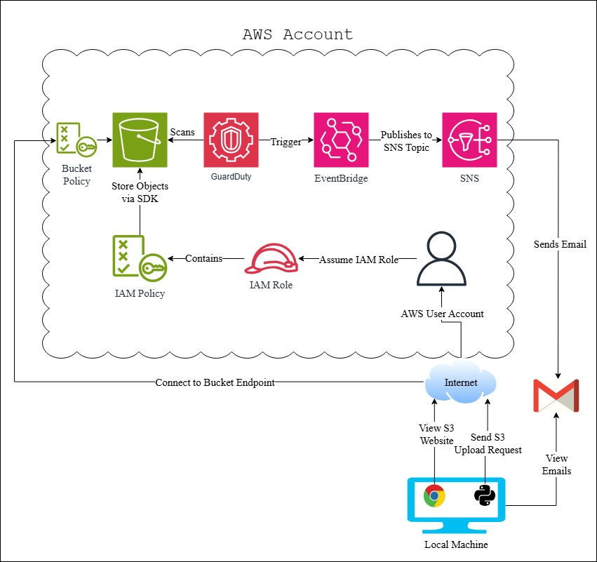

# Project Architecture

This document outlines the architecture to be implemented in the project. The diagram for the proposed architecture is shown below.

*S3 Static Website Architecture*

# Requirements
To understand the architecture diagram, requirements must first be established.  In this project, we hope to do the following:
- Create an S3 bucket that can host a static website
- The website can be accessed by the public
- The bucket contents can only be modified by users with granted permissions 
- Ensure malicious content is not being store in the bucket
- The account owner must be alerted if malicious files have been uploaded

# Functionality
In conjunction with requirements, user functionality must be identitified:
- User can upload files via Python SDK
- User can access the S3 website through the internet
- User can view emails of identified vulnerabilities

# Architecture Breakdown
**Components**

*S3* 
  - A bucket that is used to host our static website
  - Publicly accessible via Internet
  - Uploads are limited to IAM roles

*IAM*
  - Creates an IAM role that is assume to the user
  - This role contains a policy that grants access to S3 actions

*GuardDuty*
  - Initiates scans on S3 bucket for malicious files
  - If malicious, triggers to an event

*EventBridge*
  - Used to retrieve critical alerts from GuardDuty
  - Once retrieved, the information triggers an SNS push

*SNS*
  - SNS subscription created to alert email
  - SNS topic is made to include subscription protocol
  - User will be emailed once trigger goes off from EventBridge

# Benefits
This architecture offers several advantages:
- **High Availability**: The S3 bucket boasts a 99.99% availability rate.
- **High Durability**: There is an extremely low probability of data loss, with a durability rate of 99.999999999%.
- **Resource Monitoring**: The S3 bucket ensures that resources are non-malicious.
- **Alerting**: Any vulnerabilities within the S3 bucket are promptly notified.
- **Storage Scalability**: S3 provides virtually unlimited scalability for data storage.

# Downsides
Despite the numerous benefits, there are some drawbacks to this approach:
- **User Scalability**: The use of a local machine limits the scalability of the upload functionality for multiple users.
    - Although this is a limitation, the primary focus of this project is on security configurations.
    - An optimization could involve using a scalable cloud solution, such as EC2 autoscaling groups or AWS Lambda.
    - These solutions would allow the services to assume roles, rather than relying on the local machine's user.
